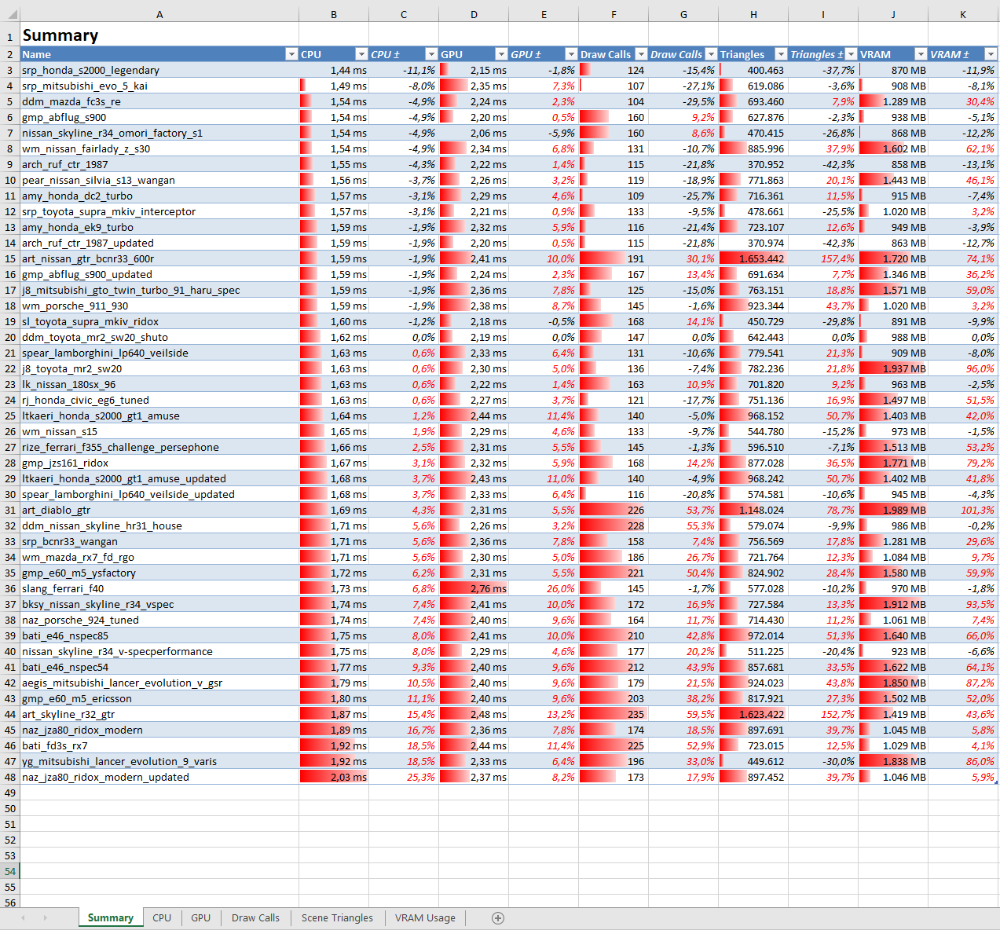
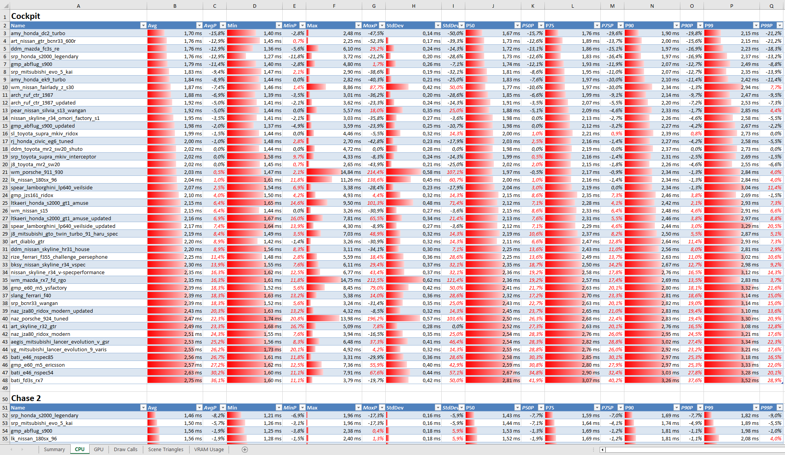

# Assetto Performance Profiler

This is a tool to collect performance data for cars/tracks and generate an Excel report.  
You can use it, for example, to compare the performance impact of different cars.

The following values are collected:

* CPU time
* GPU time
* Draw Calls
* Scene Triangles
* VRAM consumption

For each value, min/max/avg, 50/75/90/99th percentile and standard deviation are calculated.

## Installation

* Download and unpack the [latest release](https://github.com/compujuckel/Assetto.PerformanceProfiler/releases/latest).
* Copy the `ACPerformanceProfiler` app included in the `apps/lua` folder into your Assetto Corsa Lua apps folder.

## Configuration

Create a file called `configuration.yml` in the same folder as the .exe file.

```yml
Tracks:
  - Name: track_one
  - Name: track_two
Cars:
  - Model: car_one
  - Model: car_two
  - Model: car_three
  - Model: car_three_updated
    RenameTo: car_three
Scenes:
  - Name: Cockpit
    CameraMode: Cockpit
    DurationSeconds: 5
  - Name: Chase 2
    CameraMode: Drivable
    DrivableCamera: Chase2
    DurationSeconds: 5
  - Name: Free (55m)
    CameraMode: Free
    CameraPosition: { X: 29.2, Y: 4.6, Z: -44.5 }
    CameraLook: { X: -0.8, Y: -0.2, Z: 0.6 }
    CameraUp: { X: -0.2, Y: 1.0, Z: 0.1 }
    CameraFOV: 60
    DurationSeconds: 5
```

The game will be started once for each track-car combination. For the config above this would be

* `car_one` on `track_one`
* `car_two` on `track_one`
* `car_three` on `track_one`
* `car_three_updated` on `track_one`, but renamed to `car_three` before the game is launched
* `car_one` on `track_two`
* ...

After the game is launched, the camera will run through the defined scenes while recording performance data.

## Results

An Excel file will be generated in the same folder. Example screenshots:



